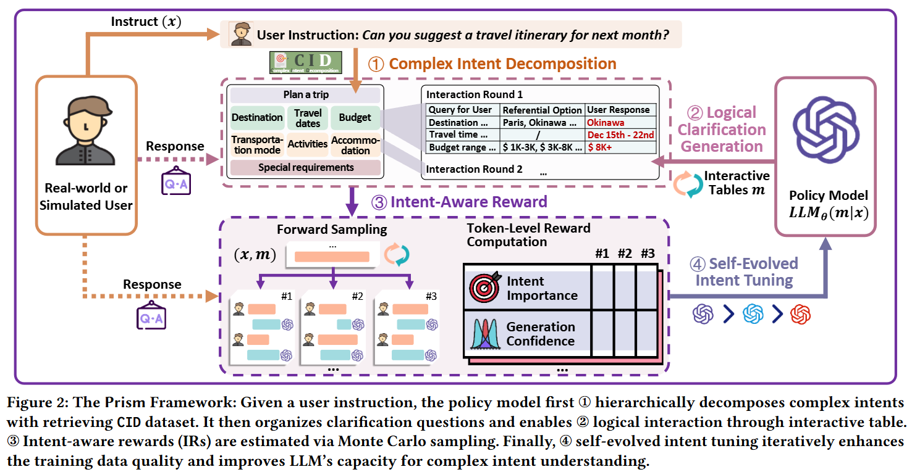
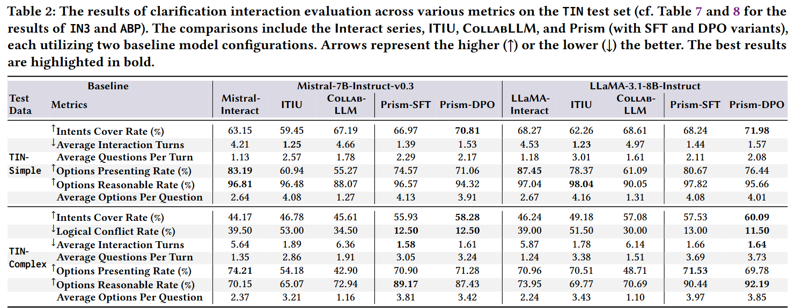
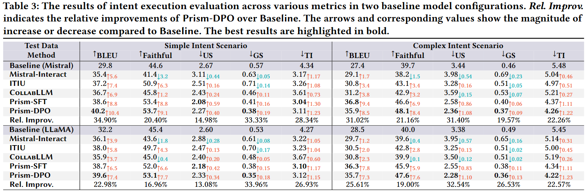
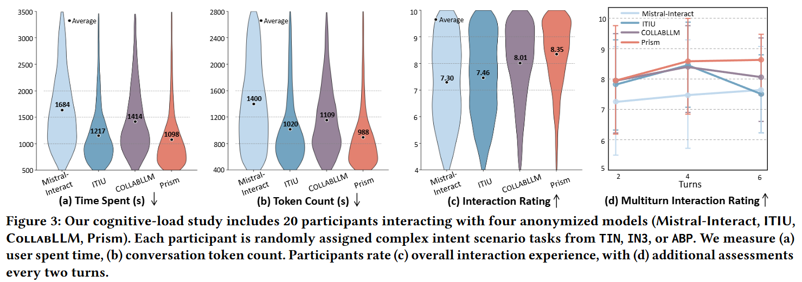
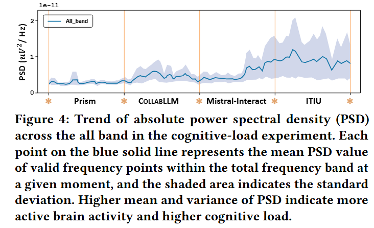

<div align="center">
  <h1> Prism: Towards Lowering User Cognitive Load in LLMs via Complex Intent Understanding</h1>
  <p><b>Official Implementation of the WWW 2026 Paper</b></p>
</div>

---

## 🧠 Overview

**Prism** is a framework designed to enhance *complex intent understanding* in large language models (LLMs) while reducing user cognitive load.  
Inspired by **Cognitive Load Theory (CLT)**, Prism decomposes, clarifies, and refines user intents through structured reasoning and multi-turn interaction.

This repository provides:
- The **source code** for Prism’s four key modules;  
- Scripts for **interaction simulation**, **reward modeling**, and **self-evolved tuning**;  
- Tools and datasets for **evaluation and benchmarking**.

---

## 🌟 Key Contributions

- **Problem Definition:** Identify *complex intent understanding* as a central challenge in user-LLM interaction.  
- **Framework Design:** Introduce **Prism**, which applies CLT principles to generate coherent and efficient clarifications.  
- **Intent-Aware Optimization:** Develop a *Monte Carlo–based intent reward mechanism* and *self-evolved tuning loop*.  
- **Empirical Validation:** Show consistent improvements across understanding, execution, and cognitive load metrics.

---

## 📖 Framework Overview

<div align="center">
  
</div>

Prism consists of four main modules:

1. **Complex Intent Decomposition**  
   Breaks composite user intents into structured subcomponents and maps logical dependencies.

2. **Logical Clarification Generation**  
   Produces context-aware clarification questions aligned with logical dependencies.

3. **Intent-Aware Reward Modeling**  
   Evaluates clarification trajectories using a custom reward function and simulates large-scale data via MCTS.

4. **Self-Evolved Intent Tuning**  
   Iteratively refines the model’s clarification ability through feedback and reinforcement.

---

## ⚙️ Installation

```bash
git clone https://github.com/yourname/prism.git
cd prism
pip install -r requirements.txt
```

**Dependencies:**  
- Python ≥ 3.10  
- PyTorch ≥ 2.0  
- HuggingFace Transformers  
- OpenBMB ModelCenter  

---

## 🛠️ Usage

### 1. Complex Intent Composition & Clarification
```bash
python composition_clarification/infer.py
```

Simulate user–assistant interactions:
```bash
python composition_clarification/mcts.py
```

### 2. Intent-Aware Reward
```bash
python intent_aware_reward/run.py
```

### 3. Self-Evolved Intent Tuning
```bash
python intent_tuning/MCTS/task.py
```

Fine-tune (SFT / DPO) with LLaMA-3-8B-Instruct:
```bash
bash scripts/sft.sh
python training/train.py
```

> **Note:** Convert model weights to bmtrain format using the [conversion script](https://github.com/OpenBMB/ModelCenter/blob/main/transfer/hugLLaMa2_bmtrainLLaMa2.py).

---

## 📊 Evaluation

Prism is evaluated in three dimensions:

1. **Clarification Interaction** — how well the model understands ambiguous user intentions.  
2. **Intent Execution** — downstream task success after clarification.  
3. **Cognitive Load Reduction** — reduction in user effort and mental strain.

### Clarification Interaction
```bash
python evaluation/clarification_interaction.py
```

**Metrics:**
- **Intents Cover Rate**: It measures the percentage of underlying fact clarification questions that are covered by clarification questions generated by the model during the interaction.
- **Logical Conflict Rate**: Indicates the proportion of clarification questions that violate prerequisite dependencies among intent elements, where lower values reflect more logically consistent and coherent clarifications.
- **Average Interaction Turns**: It calculates the average number of interaction turns per instruction. 
- **Average Questions Per Turn**: This metric determines the average number of clarification questions per turn of interaction.
- **Options Presenting Rate**: This metric evaluates the percentage of the clarification questions accompanied by potential referential options.
- **Options Reasonable Rate**: It records the percentage of referential options provided by the model that are considered reasonable.
- **Average Options Per Query**: This represents the average number of referential options the model provides per query.

<div align="center">
  
</div>

---

### Intent Execution
```bash
python evaluation/intent_execution.py
```

**Evaluation Models:** GPT-4-turbo
**Metrics:** 
- **BLEU**: An $n$-gram-precision metric with a brevity penalty that measures overlap between the model output and the reference; higher is better.
- **Intent Execution Faithfulness (Faithful)**: The proportion of final outputs judged to fully satisfy the clarified intent elements without omissions, distortions, or hallucinations.
- **Unnecessary Sub-tasks (US)**: The percent of sub-tasks that are regarded as unnecessary by the user under the detailed task goal with clear user intents.
- **General Sub-tasks (GS)**: The percent of sub-tasks that are too general, instead of focusing on the user’s specific intents.
- **Tool Invocations Per Sub-task (TI)**: The average number of tool invocations for one sub-task, which reflects the efficiency of agent execution.

<div align="center">
  
</div>

---

### Cognitive Load Analysis
```bash
python evaluation/cognitive_load.py
```
Evaluates user mental effort via interaction length, ambiguity resolution, and overall efficiency.

<div align="center">
  
</div>


<div align="center">
  
</div>


---

## 📁 Repository Structure

```
├── composition_clarification/
│   ├── infer.py
│   └── mcts.py
├── intent_aware_reward/
│   └── run.py
├── intent_tuning/
│   └── MCTS/
│       └── task.py
├── training/
│   └── train.py
├── evaluation/
│   ├── understanding_evaluation.py
│   └── execution_evaluation.py
├── data/
│   └── TIN/
└── figures/
```

---


